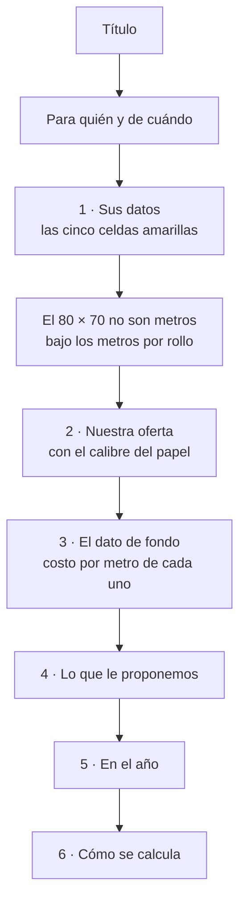

# §7.10 — Comparador de Rendimiento

**El problema.** Nuestra caja es más cara que la de la competencia, y el comprador decide mirando
el precio de la caja. Pero **el rollo no se consume por caja: se consume por metro**, y dos rollos
del mismo diámetro traen metrajes muy distintos según el grosor del papel.

El vendedor sabe que nuestro rollo cuesta menos por metro. **Lo que no tiene es cómo demostrarlo
de pie, en dos minutos, frente al comprador** — y menos aún cuando el comprador no quiere decir
cuánto paga hoy.

Este módulo convierte ese argumento en una hoja de cálculo que el cliente se lleva, llena por su
cuenta y comprueba solo.

> **La razón de ser de la herramienta es que nunca exige el precio de la competencia.** El
> vendedor entrega el archivo con **nuestros datos llenos** y las celdas del cliente vacías. Si el
> comprador no quiere decir lo que paga delante del vendedor, lo escribe después, cuando está
> solo. **Ese es el momento en que el argumento gana.**

**Fuente:** `docs/sgv-modulo-comparador-requerimientos.md`, versión 1.

---

## Por qué es un módulo aparte y no parte de §7.7

**§7.7 «Inteligencia de competencia» captura dos campos en la visita** —proveedor actual y precio
de referencia— y su valor es acumulativo: en seis meses produce el mapa de quién domina cada zona.

**Este módulo es otra cosa: es una herramienta de cierre.** Produce un documento que sale de la
empresa y llega a manos del cliente, tiene su propio catálogo de metrajes, su propio flujo y su
propio riesgo legal —un precio escrito a mano en papel con el nombre de la empresa—.

**Decisión del usuario, 1 de septiembre de 2026: va aparte.** Los dos se tocan —lo que el cliente
declare acá alimenta a §7.7— pero **no son el mismo trabajo**.

---

## Por dónde entra

**Desde la ficha de la cuenta, junto a las demás acciones del vendedor** — decisión del usuario, 1
de septiembre de 2026.

Hoy ese bloque tiene tres botones. El comparador es el cuarto:

| Botón | Qué hace |
|---|---|
| **Cotizar** | Arma la cotización en PDF |
| **Comparar rendimiento** | **El nuevo** |
| Hacer orden de venta | La nota de entrega formal |
| Pedir muestra o precio | Lo que queda de pedirle a la oficina |

**Va detrás de la misma puerta que Cotizar:** ese bloque sólo lo ve **el vendedor asignado a la
cuenta**. Es coherente con lo que ya hay —cotizar y hacer una orden también son suyos— y con que el
documento sale con el nombre de la empresa.

> **Una observación sobre el orden, para que la decidas tú:** *Cotizar* y *Hacer orden de venta* son
> el mismo documento con dos nombres, así que meter el comparador entre los dos los separa. Queda
> **justo debajo de Cotizar** como pediste; si prefieres que vaya después de los dos, es mover una
> línea.

**El nombre del botón dice qué hace, no cómo se llama el módulo.** *«Comparar rendimiento»* está en
la voz activa que usa el resto de la aplicación — igual que *Cotizar* y *Guardar visita*.

**La ruta será `/cuentas/[id]/comparador`**, siguiendo el mismo patrón que `/cotizar` y `/orden`.
*(La pantalla es de la etapa 2; se deja dicho acá porque el sitio ya está decidido.)*

---

## Las tres etapas

| Etapa | Qué produce | Estado |
|---|---|---|
| 1 | El generador del archivo Excel | **Construida** — 1 de septiembre de 2026 |
| 2 | La pantalla de captura y el cálculo en vivo | **Construida** — 2 de septiembre de 2026 |
| 3 | Catálogo de competencia, registro en la ficha y próximo paso a 3 días | Pendiente |

**El orden no es arbitrario.** El archivo es el entregable: si la hoja no convence al cliente, la
pantalla que la alimenta no importa. Se construye primero lo que el cliente ve.

---

# ETAPA 1 — El generador del archivo

## Qué recibe y qué devuelve

**Recibe:**

| De nuestro producto | Obligatorio |
|---|---|
| Precio por caja · Rollos por caja · Metros por rollo | **Sí** |

| Del cliente | Obligatorio |
|---|---|
| Precio que paga por caja · Rollos por caja · Metros por rollo · Cajas por pedido · Semanas entre pedidos | **No, ninguno** |

| Del contexto | |
|---|---|
| Nombre del cliente y fecha | Se imprimen en el encabezado |

**Devuelve** un `.xlsx` con **fórmulas vivas** — nunca resultados fijos. El cliente cambia un
número y la hoja se recalcula sola. Es lo que la convierte en una herramienta suya y no en un
folleto nuestro.

---

## Cómo se construye: se rellena la plantilla, no se dibuja el archivo

**Decisión del usuario, 1 de septiembre de 2026 — camino A.**

El sistema **abre la plantilla `.xlsx` que ya existe, cambia los números y la vuelve a cerrar.**
No dibuja el archivo desde cero.

| | Rellenar la plantilla | Dibujar el archivo por código |
|---|---|---|
| ¿Se ve igual? | **Es el mismo archivo** | Se parece si no se olvida ningún detalle |
| Peso en el celular | **8 KB** (`fflate`) | Cerca de **1 MB** (`ExcelJS`) |
| Cambiar un color o un texto | Se abre el Excel y se edita | Es una tarea de programación |

> **El argumento de fondo no es el peso: es de quién es el diseño de la hoja.** Rellenando la
> plantilla, el documento de venta **sigue siendo del negocio**. El día que se quiera cambiar una
> palabra, un color o el orden de una sección, se hace en Excel y el código no se entera.

**Lo que este camino exige a cambio:** la plantilla tiene que traer de antemano **todos los
renglones que puedan hacer falta**, aunque a veces salgan vacíos. **Estructura fija, contenido
variable.** Agregar filas por código es justo lo que ensucia el formato.

### Se escribe por nombre de celda, no por dirección

**Ésta es la decisión que evita el fallo silencioso.** Si el código escribiera el precio «en la
celda C17», el día que alguien inserte un renglón en Excel **el precio se escribiría en el sitio
equivocado y nadie se daría cuenta**: el archivo saldría bien formado, con el número en otro lado.

Por eso la plantilla lleva **nombres definidos** —lo que Excel llama rangos con nombre— y el
código escribe en `NUESTRO_PRECIO_CAJA`, no en `C17`. **Excel mueve el nombre solo** cuando se
insertan o borran filas.

**Y si un nombre no aparece, el generador se detiene con un mensaje claro** en vez de escribir a
ciegas. Un archivo mal armado que se ve bien es peor que un error.

---

## Las tres correcciones que hay que hacerle a la plantilla

Salieron de abrirla y mirarla por dentro, no de suponer.

### 1 · Los resultados guardados en caché

**La plantilla guarda el resultado de cada fórmula junto a la fórmula.** La celda del «metros por
caja» trae escrito `2250` al lado de su `=C8*C9`.

> **Si se cambian los números de entrada y se deja esa caché, Excel de celular y Google Sheets
> pueden mostrar el resultado viejo** hasta que alguien toque una celda. El cliente abriría la hoja
> con sus datos y los resultados de otro.

**Se resuelve por dos vías a la vez**, porque una sola no basta en todos los programas: se **borra
el valor guardado** de cada fórmula y se marca el libro como **«recalcular al abrir»**.

### 2 · El aviso de metraje sin medir — **puesto y retirado**

**Requisito del documento:** *«Si el metraje de la competencia está sin medir, el archivo debe
declararlo de forma visible. No se presenta como dato verificado lo que no lo es.»*

Se construyó como un renglón bajo el título, que el generador llenaba o dejaba vacío. **El 2 de
septiembre de 2026 el usuario lo mandó quitar, y la razón de fondo es más grave que la de forma.**

Lo primero que se vio fue el ancho: *«la tercera línea quedó muy extendida»*. Era una sola frase
larga en una columna de 54 caracteres, así que se derramaba hacia la derecha y descuadraba la hoja.

**Pero el texto además no decía de quién era la estimación**, y el usuario lo leyó al revés — que
es la prueba más dura que puede tener un texto: *«no decía que era de la competencia. Pareciera que
se refería a nuestro rollo... el mismo mensaje inclusive me confundió, pensé que se refería a mi
rollo, de que era una estimación»*.

**Si el dueño del sistema lo leyó al revés, el cliente lo iba a leer al revés.** Y leído al revés
dice justo lo contrario de lo que la hoja existe para decir: pone en duda **nuestro** metraje, que
es el único que sí está medido.

**La fila se borró de la plantilla** — con sus fórmulas y nombres corridos una fila hacia arriba— y
con ella se fueron el nombre `COMPARADOR_AVISO`, la función que lo redactaba, y los dos controles de
la pantalla que sólo lo alimentaban: la marca de competencia y el interruptor de *medido / estimado*.
**Un control que no alimenta nada es peor que no tenerlo**: el vendedor lo llena creyendo que sirve.

**Lo que sobrevive:** la hoja sigue ofreciendo la medición sin costo bajo los metros por rollo —
*«¿No lo dice la caja? Nosotros le medimos su rollo actual sin costo»*—, que el usuario pidió
conservar tal cual.

**No se reubica: se cierra.** Lo decidió el usuario en la misma conversación, y el argumento es que
las salvaguardas ya están puestas más abajo y **no en una sola línea, sino en cuatro**: el aviso de
que el «80 × 70» son milímetros, y el ofrecimiento de medirle el rollo sin costo.

*«Ya el vendedor hará el trabajo de explicar... ya tú colocaste más abajo que ochenta por setenta,
no se confunda, que averigüe bien, nosotros se lo medimos. Ya tenemos ahí las salvaguardas con
referencia al rollo de la competencia. No hace falta esta línea adicional, porque sí generó
confusión.»*

**La lección, que vale para todo lo que se le escriba a un cliente:** una advertencia que no nombra
a quién señala se lee sobre el que la escribe.

### 3 · Falta decir para quién es y de cuándo

**Decisión del usuario.** Un documento que lleva el nombre de la empresa y va a manos de un cliente
tiene que decir **para quién** y **de qué fecha** es. Sin eso, dos hojas de dos clientes distintos
son indistinguibles a los tres días.

---

## Cómo queda la hoja



**Las secciones 3 a 6 no las toca nadie**: son fórmulas y texto explicativo. El generador sólo
escribe en las dos primeras y en el encabezado.

---

## Las cuentas

Están en el anexo del documento de requerimientos y **la plantilla ya las tiene escritas como
fórmulas de Excel**. El generador no las recalcula: las deja vivas.

**Las mismas cuentas se escriben una vez en `src/lib/comparador.ts`** para que la pantalla de la
etapa 2 muestre en vivo **exactamente el mismo número** que va a mostrar el archivo. Escribirlas
dos veces es como se llega a que la pantalla diga una cosa y el archivo otra.

| | |
|---|---|
| **Metros por caja** | rollos por caja × metros por rollo |
| **Costo por metro** | precio de la caja ÷ metros que trae la caja |
| **Cajas equivalentes** | se **redondea hacia arriba**: no se venden cajas partidas |
| **Le dura (semanas)** | comprobación de que no se le está recortando papel |
| **En el año** | 52 ÷ semanas entre pedidos, aplicado a los dos |

> **Toda división devuelve vacío si el denominador es cero o falta el dato.** En la hoja lo
> resuelve `IFERROR`; en el código, la misma regla escrita a mano. **Un `#¡DIV/0!` en un documento
> de venta termina la conversación.**

### La regla que ninguna cifra puede romper

**Ningún número de la hoja puede salir más alto que el del cliente.** Un solo número mayor le da al
comprador el argumento para cerrar la conversación — y por eso hay **un solo escenario: equiparar
metros**. Si un cliente pide comparar manteniendo la misma cantidad de cajas, **el vendedor lo
calcula aparte, fuera de este documento.**

---

## Dónde vive cada cosa

| Archivo | Qué hace |
|---|---|
| `public/plantillas/comparador-rollos-termicos.xlsx` | **La plantilla.** Es el diseño, y se edita en Excel |
| `src/lib/comparador.ts` | Las cuentas, para la pantalla y para el archivo |
| `src/lib/comparador-xlsx.ts` | Abre la plantilla, escribe los valores, devuelve el archivo |
| `src/components/comparar-rendimiento.tsx` | **La pantalla.** Captura, cálculo en vivo y botón de compartir |
| `src/app/cuentas/[id]/comparador/page.tsx` | La ruta, y quién puede entrar |
| `src/lib/comparador.prueba.ts` | Las cuentas: los redondeos, los vacíos y las divisiones por cero |
| `src/lib/comparador-xlsx.prueba.ts` | El archivo: se arma de verdad y se lee **por nombre de celda** |
| `tsconfig.pruebas.json` | Las pruebas corren en Node, no en el navegador, y necesitan otro objetivo |
| `docs/comparador-rollos-termicos.xlsx` | La plantilla original de referencia, sin tocar |

**Se genera en el celular, no en el servidor.** Lo obliga el requisito de trabajar **sin señal en
la calle**: si lo armara el servidor, sin internet no habría archivo. Es el mismo camino que ya usa
la cotización en PDF, que se arma en el teléfono y se comparte con el botón nativo.

---

## Lo que todavía **no** hace

| | Dónde va |
|---|---|
| El catálogo de marcas de competencia y sus metrajes | **Etapa 3** |
| Guardar el cálculo en la ficha del cliente | **Etapa 3** |
| Crear el próximo paso a 3 días | **Etapa 3** |

---

# ETAPA 2 — La pantalla de captura

## Qué hace

El vendedor captura de pie, frente al comprador, y **el resultado se mueve mientras teclea**. Ése es
el punto del módulo: el argumento se demuestra en la conversación, no en un archivo que el cliente
abrirá tres días después. **El archivo es para cuando el vendedor ya no está.**

**Ningún dato del cliente es obligatorio.** Si hubiera que exigirle el precio que paga hoy, la
herramienta no serviría con el cliente que no lo quiere decir — que es justamente el que hay que
convencer. Lo único obligatorio son nuestros tres números; sin ellos el botón no se habilita.

**No guarda nada.** El registro en el expediente y el próximo paso a tres días son la etapa 3.

## El descuadre de duración avisa antes de que la hoja salga

El anexo de fórmulas lo pide: la duración de lo que proponemos tiene que dar prácticamente igual a
la que el cliente tiene hoy. **No es un argumento de venta, es un detector de datos mal
capturados.** La pantalla compara las dos y avisa si se separan más de media semana.

Descubrirlo ahí vale mucho más que descubrirlo con la hoja ya abierta delante del cliente.

---

## Los dos avisos que pidió el usuario el 2 de septiembre de 2026

### 1 · El «80 × 70» no son metros

**Es la trampa que la competencia deja puesta.** En palabras del usuario: *«ochenta todo mundo
entiende que es el ancho del papel, pero el setenta es lo que tratan de confundir con nosotros, de
que son setenta metros»*. La caja y la factura dicen `80 × 70` **sin decir la unidad**. Los dos
números son milímetros: 80 de ancho de papel y 70 de diámetro del rollo. **Ninguno de los dos dice
cuántos metros trae**, que es lo único que el cliente consume.

Va en dos sitios, que son el mismo sitio en momentos distintos:

| Dónde | Para quién |
|---|---|
| Bajo el campo «Metros de papel por rollo» de la pantalla | **El vendedor**, en el instante en que está por escribir el número equivocado, con la caja del cliente delante |
| Bajo esa misma línea en la hoja, y otra vez en la sección 6 | **El cliente**, cuando la llena solo |

**No acusa a nadie.** Dice qué son las unidades y se detiene ahí: el archivo lleva el nombre de la
casa y queda por escrito en manos de un tercero.

### 2 · El calibre del papel

Se ofrecen **48 y 55 gramos por metro cuadrado**, y el vendedor lo escoge junto al precio, los
rollos y los metros.

**No entra en ninguna cuenta: se declara.** Y aun así es el dato que sostiene el argumento entero —
un papel más delgado da más metros en el mismo diámetro de rollo, que es exactamente por qué nuestra
caja rinde más. La sección 6 de la hoja ya explicaba la relación entre grosor y metraje; **lo que
faltaba era decir de qué grosor estamos hablando.**

**Hoy los dos calibres están escritos en la pantalla.** Cuando exista catálogo de productos, saldrán
de ahí.

---

## La hoja sale firmada: logo, casa y vendedor

**«La calculadora no tiene el nombre de nuestra empresa ni tampoco el nombre del vendedor que le
está generando este documento con su número de contacto.»** El usuario, 2 de septiembre de 2026:
*«sería bueno dejar esto como si fuera una tarjeta de presentación»*.

Es el mismo argumento que el de imprimir en una página, llevado hasta el final: **el documento
sobrevive a la visita.** Quien lo lee después —el jefe que aprueba— muchas veces no estuvo en la
conversación, y si al leerlo decide comprar, tiene que poder llamar sin volver a preguntar quién
trajo el papel.

El encabezado son cuatro renglones:

| Fila | Qué lleva | De dónde sale |
|---|---|---|
| 1 | El logo, y nada más | `public/logo-papeleria.png`, **incrustado** en el archivo |
| 2 | Comparación de costo real de rollos térmicos | La plantilla |
| 3 | Preparado para *cliente* · *fecha* | La cuenta y el reloj |
| 4 | Vendedor que le visita: *nombre* · *teléfono* | El perfil de quien tiene la sesión abierta |

El logo **no es un enlace: viaja dentro del `.xlsx`**, así que se ve aunque el cliente lo abra sin
internet.

### «Todavía no somos sus vendedores»

El renglón decía «Su vendedor:» y el usuario lo cortó el 2 de septiembre de 2026: *«todavía no
somos sus vendedores... todavía no le estamos vendiendo»*. **La hoja se entrega en una visita a
alguien que hoy le compra a otro**, y darse por su proveedor en el encabezado es empezar mintiendo.
Quedó **«Vendedor que le visita:»**, que es su propia frase y es exacta. Hay una prueba que cuida
las palabras, porque ese rótulo es lo primero que el cliente lee de nosotros.

### El renglón de la empresa se quitó

Estuvo unas horas: nombre, teléfono, correo y web de la casa. **Lo quitó el usuario en la misma
conversación**: el logo ya dice de quién es la hoja, y el teléfono del vendedor ya da a quién
llamar. Un dato repetido en un documento de una página cuesta un renglón y no agrega nada.

**Lo que se pierde, y conviene saberlo:** impresa en blanco y negro, si el logo sale pobre, la hoja
no dice en ninguna parte el nombre de la empresa en texto. Si algún día molesta, la salida es
meterlo en el mismo renglón del vendedor —«Ana Ruiz, de Papelería Comercial · 6000-0000»— sin gastar
un renglón nuevo.

### Por qué el título no va al lado del logo

Se pidió **correr el texto a la derecha del logo**, y Excel no sabe hacer eso: una imagen flota por
encima de la cuadrícula y **el texto de una celda no la esquiva**. Las dos maneras de conseguirlo
son sangrar el texto —cuya unidad mide distinto en Excel, en Google Sheets y en el celular, así que
se ve bien en uno y pisado en otro— o abrir una columna entera para el logo, que obliga a angostar
el texto y entonces no cabe a lo alto.

**Entre un encabezado que se ve bien en todos lados y uno que se ve mejor en el mío, va el
primero**: el archivo se abre en el aparato del cliente, no en el nuestro. El logo quedó solo en la
fila 1 —vacía a propósito, y hay una prueba que la vigila— y el título en la 2.

### Lo que falta no deja huecos

**Un separador suelto delata que falta un dato.** «Papelería Comercial ·  · » se lee como descuido, y
esta hoja es lo único que la casa deja sobre la mesa. Los renglones se arman descartando lo vacío, y
**sin nombre de vendedor no sale ni el rótulo**: «Su vendedor:» a secas es peor que el silencio.

### Qué está aplicado y dónde

**Los dos ambientes tienen bases separadas desde el día uno**, así que una migración aplicada en uno
no existe en el otro. Es el paso que se olvida: se despliega el código y la columna no está.

| | `sgv-pacsa-dev` (rama `dev`) | `sgv-pacsa-prod` (rama `main`) |
|---|---|---|
| Código del Comparador | Desplegado | **No** |
| Columna `perfiles.telefono` | **Aplicada** el 2 de septiembre de 2026, y comprobada contra la base | **No** |
| Probado de punta a punta | Sí: se capturó un teléfono, se guardó y volvió a leerse | — |

**Al pasar a producción van los dos juntos**: fusionar `dev` en `main` y aplicar la migración contra
`sgv-pacsa-prod`. Con el código sin la columna, la hoja sale sin el renglón del vendedor — no se
cae, pero pierde la mitad que cierra el circuito.

### El teléfono del vendedor no existía

Del vendedor había nombre; **el teléfono no estaba en ninguna parte**. Lo agrega la migración
`20260902120000_telefono_del_vendedor.sql`, y **no hizo falta política nueva**: `perfiles_update_propio`
ya deja a cada quien escribir su propio perfil y a nadie el ajeno.

**Se pide en la misma pantalla del Comparador, no en una de perfil, porque el SGV no tiene una.** Se
pregunta donde hace falta, se guarda, y de la segunda vez en adelante ya viene puesto. El guardado va
**aparte de la hoja**: si falla —sin señal en la calle, que es el caso normal— el archivo sale igual y
lo único que pasa es que se vuelve a pedir. Frenar al vendedor con el cliente delante por no haber
podido guardar un teléfono sería el peor intercambio posible.

### Dos trampas que costaron un rato

**El signo de dólar en un texto de reemplazo.** Al reescribir el área de impresión, el
`'Comparacion'!$B$1:$D$55` se escribió como cadena de reemplazo de un `replace` — y ahí `$1` no es
texto, **es el primer grupo capturado**. El resultado fue un área de impresión partida en dos
entradas rotas. Una referencia de Excel está hecha de signos de dólar, así que **toda referencia
escrita como reemplazo es una bomba**: va como función, donde el texto es texto.

**La hoja se llama `Comparacion`, sin tilde**, y dos nombres nuevos se escribieron con tilde.
Apuntaban a una hoja inexistente **y el archivo abría igual**: la celda simplemente no se llenaba.
Hoy el nombre de la hoja se lee del archivo, nunca se escribe a mano, y hay una prueba que compara
los dos.

---

## Cabe en una hoja carta, y es un requisito

**«Ya dos páginas rompe esto.»** El usuario, el 2 de septiembre de 2026, al intentar imprimirla:
*«el cliente no lo va a imprimir... es importante que lo pueda imprimir y llevárselo a una tercera
persona para una lectura comprensiva de una sola página. Usualmente es el jefe que aprueba y hay que
llevárselo en ese formato.»*

**La hoja se lee en pantalla, pero se decide en papel.** Quien aprueba la compra muchas veces no es
quien recibió el archivo, y lo que le llega es una impresión.

### Tres cosas estaban mal, y ninguna se ve abriendo el archivo

| | |
|---|---|
| El papel estaba en **A4**, no en carta | `paperSize="9"` |
| El **ajuste a una página estaba apagado** | `fitToPage="false"`, así que los `fitToWidth` que el archivo ya traía **no hacían nada** |
| Márgenes de **una pulgada** arriba y abajo | Se comían el 18 % del alto útil |

### El ancho sobraba: la columna D medía 3

La hoja ocupaba **5,7 de las 8 pulgadas imprimibles**. Bastó llevar la columna D de 3 a 28 para que
cada línea de texto disponga de ~100 caracteres.

**Sin combinar celdas, y es deliberado.** En Excel un texto largo se derrama solo sobre las columnas
vacías de la derecha; **dentro de una celda combinada, en cambio, lo que sobra se corta en
silencio**. Entre un texto que se derrama y uno que se recorta sin avisar, se elige el primero. Es
lo que pidió el usuario: *«extender la línea por debajo de la segunda columna... que se extienda a
dos o tres columnas dentro del margen de la página»*.

### Y el largo se resumió

De **65 renglones a 54**. Donde una frase ocupaba tres renglones partidos ahora ocupa uno, y la
sección 6 se recortó porque *«al final hay mucha explicación»*. Los separadores en blanco bajaron a
6 puntos: siguen separando, dejaron de ocupar lo mismo que un renglón escrito.

**Resultado: 10,31 pulgadas de alto contra 10,50 disponibles**, y el ajuste a una página encendido
como red por si algún programa mide distinto.

### El error de medición, que vale más que el arreglo

La primera medición dijo **10,02 pulgadas** y la hoja medía **11,27**. La suma recorría las filas
que el archivo trae escritas, y **seis separadores no estaban escritos**: una fila en blanco sin
formato propio no genera elemento `<row>`, pero Excel igual le da su alto al imprimir.

**Cabía en la aritmética y no en el papel.** Hoy las 54 filas están escritas —lo que además vuelve el
alto igual en cualquier programa— y **la prueba se niega a medir si encuentra un hueco**, en vez de
devolver un número tranquilizador.

> Una medición que sólo mira lo que está escrito no mide lo que se imprime.

---

## Cómo se comprueba

El SGV no tenía corredor de pruebas. **Ahora corre el de Node**, sin instalar nada:

```
npm run prueba   · las 13 pruebas
npm run listo    · pruebas + los dos tsc + la compilación
```

**Las pruebas se validaron rompiendo a propósito lo que dicen cuidar**, y cada ruptura hizo fallar
sólo a la prueba que le tocaba:

| Se rompió | Protestó |
|---|---|
| El redondeo de cajas, hacia abajo en vez de hacia arriba | sí |
| La regla de todo-o-nada de los datos del cliente | sí |
| La hoja crece 20 filas | sí |
| El papel vuelve a A4 | sí |
| Se apaga el ajuste a una página | sí |
| Una línea de 150 caracteres, que se cortaría al imprimir | sí |
| Se borra una fila y queda un hueco sin medir | sí |

Y las que cuidan la firma, que **no se pueden validar rompiendo la plantilla** porque miran lo que
escribe el generador: que el rótulo diga «Vendedor que le visita» y no «Su vendedor», que los
renglones se armen sin separadores sueltos, que sin nombre no salga el rótulo, que **el logo ancle
en la columna B de una fila 1 vacía**, que las cuatro piezas del logo estén en el paquete, y que
ningún nombre apunte a una hoja que no existe.

**Una prueba que pasa sin ejercitar lo que dice ejercitar es peor que no tenerla**, porque después se
confía. Y una de estas se escribió mal la primera vez: el patrón llevaba `\d` dentro de una
plantilla de texto, donde **la barra invertida se pierde y el patrón acaba buscando la letra «d»**.
No dio error de sintaxis; dio `null`. Por eso los rangos se escriben `[0-9.]`.

**Lo que ninguna prueba cubre:** que la hoja abra bien en Excel de celular y en Google Sheets. Eso
se comprueba abriéndola, y lo hace el usuario.

---

## Riesgos que este módulo no resuelve, y hay que tener presentes

**El precio escrito a mano.** El vendedor puede poner un precio por debajo de lista **en un
documento que lleva el nombre de la empresa y queda por escrito en manos del cliente**. Falta
decidir si se valida contra la lista de precios o si basta con que quede auditable. **Es una
decisión de negocio, no técnica**, y la etapa 1 no la prejuzga.

**El metraje sin medir es el punto débil de todo el argumento.** Si el cliente cuestiona la cifra y
el vendedor no la puede sustentar, se pierde la conversación completa. **La tabla de metrajes
medidos es un prerrequisito, no un accesorio**.

**La hoja no lleva una advertencia escrita de que ese metraje sea estimado**, y es deliberado desde
el 2 de septiembre de 2026: la que llevaba se leía como si el metraje dudoso fuera el nuestro. Lo
que la hoja sí hace es decir que el «80 × 70» no son metros y ofrecer la medición sin costo — dos
salvaguardas que apuntan al rollo de la competencia sin dejar duda de cuál es cuál. **El resto lo
sostiene el vendedor en la conversación**, que es donde el usuario decidió que viva.

**La hoja declara nuestro calibre y no pregunta el suyo.** Es lo que se pidió, y se construyó así,
pero conviene tenerlo escrito: **un cliente que sepa del tema va a preguntar de qué gramaje es lo
que compra hoy**, y la hoja no tiene dónde ponerlo. Queda como decisión abierta, no como olvido.

**No hay forma de saber si el cliente abrió la hoja.** El seguimiento a tres días es la única señal
disponible.

---

## Historial

| Fecha | Qué cambió |
|---|---|
| 2026-09-02 | **Encabezado corregido**: el logo pasa a la izquierda en su propia fila —a la derecha pisaba el título—, se quita el renglón de la empresa, y «Su vendedor» pasa a «Vendedor que le visita»: *«todavía no somos sus vendedores»* |
| 2026-09-02 | **La hoja sale firmada**: logo incrustado, datos de la empresa y del vendedor con su teléfono. Migración `telefono_del_vendedor`; el teléfono se pide en la propia pantalla porque el SGV no tiene pantalla de perfil |
| 2026-09-02 | **La hoja cabe en una carta.** De 65 renglones a 54, columna D de 3 a 28 para que el texto se derrame sin combinar celdas, papel de A4 a carta, `fitToPage` encendido y márgenes a un cuarto de pulgada. Dos redes nuevas: que quepa y que ninguna línea se corte |
| 2026-09-02 | **Se retira el aviso de metraje sin medir, y no vuelve.** Ocupaba demasiado ancho, pero el motivo de fondo es que **no decía de quién era la estimación** y el propio usuario lo leyó como si dudara de nuestro rollo. Las salvaguardas quedan en el aviso del «80 × 70» y en el ofrecimiento de medir. Con él se van `COMPARADOR_AVISO`, la marca de competencia y el interruptor de medido/estimado |
| 2026-09-02 | **Etapa 2 construida**: pantalla, cálculo en vivo y botón de compartir. Tres pedidos del usuario: el aviso de que el «80 × 70» son milímetros y no metros, el calibre del papel en nuestra oferta, y el texto de la medición gratuita que se conserva tal cual. Se agregó corredor de pruebas |
| 2026-09-01 | Documento inicial. **Cuatro decisiones del usuario:** se rellena la plantilla en vez de dibujar el archivo, el módulo va aparte de §7.7, el aviso de metraje sin medir va arriba, y la hoja lleva nombre del cliente y fecha |
