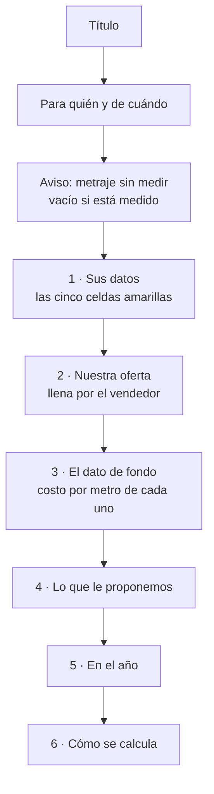

# §7.10 — Comparador de Rendimiento

**El problema.** Nuestra caja es más cara que la de la competencia, y el comprador decide mirando
el precio de la caja. Pero **el rollo no se consume por caja: se consume por metro**, y dos rollos
del mismo diámetro traen metrajes muy distintos según el grosor del papel.

El vendedor sabe que nuestro rollo cuesta menos por metro. **Lo que no tiene es cómo demostrarlo
de pie, en dos minutos, frente al comprador** — y menos aún cuando el comprador no quiere decir
cuánto paga hoy.

Este módulo convierte ese argumento en una hoja de cálculo que el cliente se lleva, llena por su
cuenta y comprueba solo.

> **La razón de ser de la herramienta es que nunca exige el precio de la competencia.** El
> vendedor entrega el archivo con **nuestros datos llenos** y las celdas del cliente vacías. Si el
> comprador no quiere decir lo que paga delante del vendedor, lo escribe después, cuando está
> solo. **Ese es el momento en que el argumento gana.**

**Fuente:** `docs/sgv-modulo-comparador-requerimientos.md`, versión 1.

---

## Por qué es un módulo aparte y no parte de §7.7

**§7.7 «Inteligencia de competencia» captura dos campos en la visita** —proveedor actual y precio
de referencia— y su valor es acumulativo: en seis meses produce el mapa de quién domina cada zona.

**Este módulo es otra cosa: es una herramienta de cierre.** Produce un documento que sale de la
empresa y llega a manos del cliente, tiene su propio catálogo de metrajes, su propio flujo y su
propio riesgo legal —un precio escrito a mano en papel con el nombre de la empresa—.

**Decisión del usuario, 1 de septiembre de 2026: va aparte.** Los dos se tocan —lo que el cliente
declare acá alimenta a §7.7— pero **no son el mismo trabajo**.

---

## Por dónde entra

**Desde la ficha de la cuenta, junto a las demás acciones del vendedor** — decisión del usuario, 1
de septiembre de 2026.

Hoy ese bloque tiene tres botones. El comparador es el cuarto:

| Botón | Qué hace |
|---|---|
| **Cotizar** | Arma la cotización en PDF |
| **Comparar rendimiento** | **El nuevo** |
| Hacer orden de venta | La nota de entrega formal |
| Pedir muestra o precio | Lo que queda de pedirle a la oficina |

**Va detrás de la misma puerta que Cotizar:** ese bloque sólo lo ve **el vendedor asignado a la
cuenta**. Es coherente con lo que ya hay —cotizar y hacer una orden también son suyos— y con que el
documento sale con el nombre de la empresa.

> **Una observación sobre el orden, para que la decidas tú:** *Cotizar* y *Hacer orden de venta* son
> el mismo documento con dos nombres, así que meter el comparador entre los dos los separa. Queda
> **justo debajo de Cotizar** como pediste; si prefieres que vaya después de los dos, es mover una
> línea.

**El nombre del botón dice qué hace, no cómo se llama el módulo.** *«Comparar rendimiento»* está en
la voz activa que usa el resto de la aplicación — igual que *Cotizar* y *Guardar visita*.

**La ruta será `/cuentas/[id]/comparador`**, siguiendo el mismo patrón que `/cotizar` y `/orden`.
*(La pantalla es de la etapa 2; se deja dicho acá porque el sitio ya está decidido.)*

---

## Las tres etapas

| Etapa | Qué produce | Estado |
|---|---|---|
| **1** | **El generador del archivo Excel** | **En construcción** |
| 2 | La pantalla de captura y el cálculo en vivo | Pendiente |
| 3 | Catálogo de competencia, registro en la ficha y próximo paso a 3 días | Pendiente |

**El orden no es arbitrario.** El archivo es el entregable: si la hoja no convence al cliente, la
pantalla que la alimenta no importa. Se construye primero lo que el cliente ve.

---

# ETAPA 1 — El generador del archivo

## Qué recibe y qué devuelve

**Recibe:**

| De nuestro producto | Obligatorio |
|---|---|
| Precio por caja · Rollos por caja · Metros por rollo | **Sí** |

| Del cliente | Obligatorio |
|---|---|
| Precio que paga por caja · Rollos por caja · Metros por rollo · Cajas por pedido · Semanas entre pedidos | **No, ninguno** |

| Del contexto | |
|---|---|
| Nombre del cliente y fecha | Se imprimen en el encabezado |
| Marca de competencia y si su metraje está **medido** o **sin medir** | Decide el aviso de arriba |

**Devuelve** un `.xlsx` con **fórmulas vivas** — nunca resultados fijos. El cliente cambia un
número y la hoja se recalcula sola. Es lo que la convierte en una herramienta suya y no en un
folleto nuestro.

---

## Cómo se construye: se rellena la plantilla, no se dibuja el archivo

**Decisión del usuario, 1 de septiembre de 2026 — camino A.**

El sistema **abre la plantilla `.xlsx` que ya existe, cambia los números y la vuelve a cerrar.**
No dibuja el archivo desde cero.

| | Rellenar la plantilla | Dibujar el archivo por código |
|---|---|---|
| ¿Se ve igual? | **Es el mismo archivo** | Se parece si no se olvida ningún detalle |
| Peso en el celular | **8 KB** (`fflate`) | Cerca de **1 MB** (`ExcelJS`) |
| Cambiar un color o un texto | Se abre el Excel y se edita | Es una tarea de programación |

> **El argumento de fondo no es el peso: es de quién es el diseño de la hoja.** Rellenando la
> plantilla, el documento de venta **sigue siendo del negocio**. El día que se quiera cambiar una
> palabra, un color o el orden de una sección, se hace en Excel y el código no se entera.

**Lo que este camino exige a cambio:** la plantilla tiene que traer de antemano **todos los
renglones que puedan hacer falta**, aunque a veces salgan vacíos. **Estructura fija, contenido
variable.** Agregar filas por código es justo lo que ensucia el formato.

### Se escribe por nombre de celda, no por dirección

**Ésta es la decisión que evita el fallo silencioso.** Si el código escribiera el precio «en la
celda C17», el día que alguien inserte un renglón en Excel **el precio se escribiría en el sitio
equivocado y nadie se daría cuenta**: el archivo saldría bien formado, con el número en otro lado.

Por eso la plantilla lleva **nombres definidos** —lo que Excel llama rangos con nombre— y el
código escribe en `NUESTRO_PRECIO_CAJA`, no en `C17`. **Excel mueve el nombre solo** cuando se
insertan o borran filas.

**Y si un nombre no aparece, el generador se detiene con un mensaje claro** en vez de escribir a
ciegas. Un archivo mal armado que se ve bien es peor que un error.

---

## Las tres correcciones que hay que hacerle a la plantilla

Salieron de abrirla y mirarla por dentro, no de suponer.

### 1 · Los resultados guardados en caché

**La plantilla guarda el resultado de cada fórmula junto a la fórmula.** La celda del «metros por
caja» trae escrito `2250` al lado de su `=C8*C9`.

> **Si se cambian los números de entrada y se deja esa caché, Excel de celular y Google Sheets
> pueden mostrar el resultado viejo** hasta que alguien toque una celda. El cliente abriría la hoja
> con sus datos y los resultados de otro.

**Se resuelve por dos vías a la vez**, porque una sola no basta en todos los programas: se **borra
el valor guardado** de cada fórmula y se marca el libro como **«recalcular al abrir»**.

### 2 · El aviso de metraje sin medir no tiene dónde ir

**Requisito del documento:** *«Si el metraje de la competencia está sin medir, el archivo debe
declararlo de forma visible. No se presenta como dato verificado lo que no lo es.»*

**Va arriba, debajo del título** — decisión del usuario. Es lo primero que se lee, antes que
cualquier número.

**El renglón existe siempre en la plantilla**, y el generador lo llena o lo deja vacío. Cuando el
metraje está sin medir dice, con todas las letras, que esa cifra es una estimación y que la empresa
puede medir el rollo del cliente sin costo.

### 3 · Falta decir para quién es y de cuándo

**Decisión del usuario.** Un documento que lleva el nombre de la empresa y va a manos de un cliente
tiene que decir **para quién** y **de qué fecha** es. Sin eso, dos hojas de dos clientes distintos
son indistinguibles a los tres días.

---

## Cómo queda la hoja

**Las secciones 3 a 6 no las toca nadie**: son fórmulas y texto explicativo. El generador sólo
escribe en las dos primeras y en el encabezado.

---

## Las cuentas

Están en el anexo del documento de requerimientos y **la plantilla ya las tiene escritas como
fórmulas de Excel**. El generador no las recalcula: las deja vivas.

**Las mismas cuentas se escriben una vez en `src/lib/comparador.ts`** para que la pantalla de la
etapa 2 muestre en vivo **exactamente el mismo número** que va a mostrar el archivo. Escribirlas
dos veces es como se llega a que la pantalla diga una cosa y el archivo otra.

| | |
|---|---|
| **Metros por caja** | rollos por caja × metros por rollo |
| **Costo por metro** | precio de la caja ÷ metros que trae la caja |
| **Cajas equivalentes** | se **redondea hacia arriba**: no se venden cajas partidas |
| **Le dura (semanas)** | comprobación de que no se le está recortando papel |
| **En el año** | 52 ÷ semanas entre pedidos, aplicado a los dos |

> **Toda división devuelve vacío si el denominador es cero o falta el dato.** En la hoja lo
> resuelve `IFERROR`; en el código, la misma regla escrita a mano. **Un `#¡DIV/0!` en un documento
> de venta termina la conversación.**

### La regla que ninguna cifra puede romper

**Ningún número de la hoja puede salir más alto que el del cliente.** Un solo número mayor le da al
comprador el argumento para cerrar la conversación — y por eso hay **un solo escenario: equiparar
metros**. Si un cliente pide comparar manteniendo la misma cantidad de cajas, **el vendedor lo
calcula aparte, fuera de este documento.**

---

## Dónde vive cada cosa

| Archivo | Qué hace |
|---|---|
| `public/plantillas/comparador-rollos-termicos.xlsx` | **La plantilla.** Es el diseño, y se edita en Excel |
| `src/lib/comparador.ts` | Las cuentas, para la pantalla y para el archivo |
| `src/lib/comparador-xlsx.ts` | Abre la plantilla, escribe los valores, devuelve el archivo |
| `docs/comparador-rollos-termicos.xlsx` | La plantilla original de referencia, sin tocar |

**Se genera en el celular, no en el servidor.** Lo obliga el requisito de trabajar **sin señal en
la calle**: si lo armara el servidor, sin internet no habría archivo. Es el mismo camino que ya usa
la cotización en PDF, que se arma en el teléfono y se comparte con el botón nativo.

---

## Lo que la etapa 1 **no** hace

| | Dónde va |
|---|---|
| La pantalla de captura y el cálculo en vivo | **Etapa 2** |
| El catálogo de marcas de competencia y sus metrajes | **Etapa 3** |
| Guardar el cálculo en la ficha del cliente | **Etapa 3** |
| Crear el próximo paso a 3 días | **Etapa 3** |

---

## Riesgos que este módulo no resuelve, y hay que tener presentes

**El precio escrito a mano.** El vendedor puede poner un precio por debajo de lista **en un
documento que lleva el nombre de la empresa y queda por escrito en manos del cliente**. Falta
decidir si se valida contra la lista de precios o si basta con que quede auditable. **Es una
decisión de negocio, no técnica**, y la etapa 1 no la prejuzga.

**El metraje sin medir es el punto débil de todo el argumento.** Si el cliente cuestiona la cifra y
el vendedor no la puede sustentar, se pierde la conversación completa. **La tabla de metrajes
medidos es un prerrequisito, no un accesorio** — por eso el aviso va arriba y no al pie.

**No hay forma de saber si el cliente abrió la hoja.** El seguimiento a tres días es la única señal
disponible.

---

## Historial

| Fecha | Qué cambió |
|---|---|
| 2026-09-01 | Documento inicial. **Cuatro decisiones del usuario:** se rellena la plantilla en vez de dibujar el archivo, el módulo va aparte de §7.7, el aviso de metraje sin medir va arriba, y la hoja lleva nombre del cliente y fecha |
